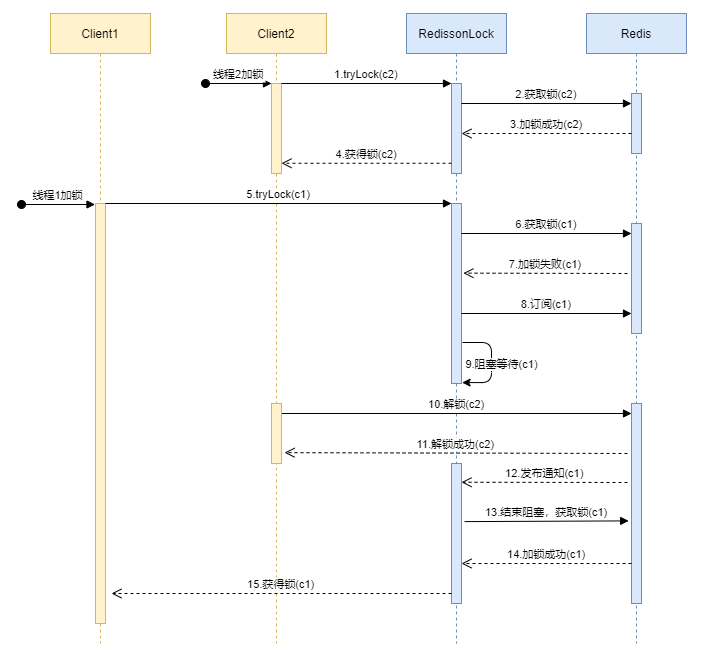
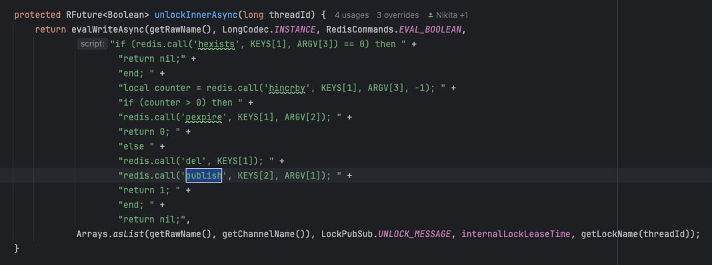
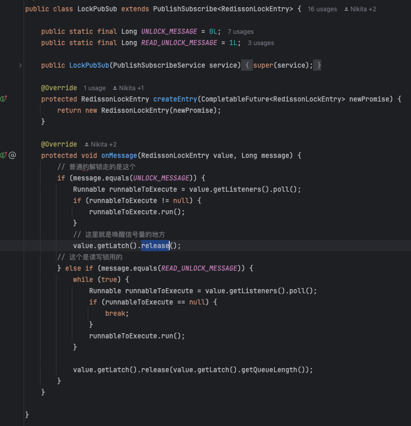

## Redisson源码解析（结合Redis实现分布式锁和AQS本地锁）

### 前置知识

#### Redis实现分布式锁相关知识简介

本地锁是解决同一个进程下的不同线程对资源的占用，
无法解决分布式部署环境下，不同服务器对资源的占用问题。
所以需要一个大家都能访问到的第三方公共资源，去标记谁抢到锁即拿到资源。
这个第三方公共资源可以是mysql、zookeeper、redis等，各有千秋。

从锁的基本功能互斥性出发，我们可以利用redis setnx来实现这个功能，然后不断改善。加上lua脚本保证原子性操作，加上特定value不会误释放锁，加上过期时间保证程序宕机不会死锁。但最后发现这个过期时间不好确定，设短了会提前过期，设长了影响性能。

而我们今天讲的redisson就是一个封装好了的框架，用redis实现分布式锁功能，并且加入看门狗机制，解决过期时长不好设置问题。并且封装好的框架，也能额外支持分布式锁的可重入、高可用等高级特性。

#### AQS相关知识简介

AQS是JUC包下的一个类，全称是AbstractQueuedSynchronizer，是一个用来构建锁或者其他同步装置的框架。

以ReentrantLock，来看看AQS的使用。它是本地锁，独占式锁，可重入锁。
以ReentrantLock有两个概念比较重要，一个是volatile类型的state表示锁的状态，一个是Node节点。
抢锁的本质是线程去cas操作state+1，第一次抢就是cas state 0到1，可重入就是已抢占锁的线程去state+1，相应释放锁就是-1，直到state=0表示没有人占用锁。
如果没抢到，就会把当前线程封装成一个Node节点，放到队列中排队。Node节点里打包了线程信息、前置、后置、节点状态。各个Node节点共同组成了有虚拟头节点的双向链表，通过next、prev指向排在前后的节点。
初始状态时即没人排队时，头尾节点合一是个空Node。有线程被打包成Node进入排队队列后，则让头节点后的第一个节点即队首去尝试抢锁，后面的节点会阻塞等待唤醒，直到释放锁后会唤醒，此时之前的队首线程可以抢到空闲下来的锁资源，之前排在后面的Node节点则依次递补，新的队首来尝试抢锁，其余的继续自旋等待唤醒。
这就是AQS中ReentrantLock可重入锁独占式锁的大体逻辑。

#### Redisson框架结合Redis实现分布式锁和AQS本地锁

之所以简单提及前面两个知识点，主要是因为Redisson框架里既包含了利用Redis的lua脚本实现分布式锁，也有利用AQS本地锁中的Semaphore共享锁机制。
前者很容易理解，redisson框架本就是对redis实现分布式锁的封装。
后者，分布式锁框架里用到本地锁主要是为了避免单台服务器对redis资源的频繁访问，减少redis的压力，提高性能。
关于这个分布式锁也用到了本地锁的逻辑，这里就简单提一下，后面再详细分析。

###  Redisson核心内容

### 加锁

RedissonLock#tryLock(long, long, java.util.concurrent.TimeUnit)

加锁整体流程

- 尝试加锁，成功直接返回true
- 判断超时
- 订阅
- 判断超时
- 循环（尝试获取锁 → 判断超时 → 阻塞等待）

分清两种tryAcquire

- 第1种tryAcquire是redisson实现的，核心：RedissonLock#tryAcquireAsync(long waitTime, long leaseTime, TimeUnit unit, long threadId)方法，主要分为两段逻辑：
  - 调用lua脚本加锁：tryLockInnerAsync
  - 未指定持有锁时间时才new看门狗：scheduleExpirationRenewal
- 第2种tryAcquire是AQS Semaphore实现的
  - 先本地线程去争夺令牌，数量为1，成功争到令牌就返回了。然后判断超时，没有超时就会在while循环中去调用第1种tryAcquire去尝试抢分布式锁
  - 没有成功争到令牌的，加入同步队列，然后这里搞个for循环让队首的去争夺令牌，争到了的会跳出去while循环中尝试抢分布式锁，没争到且还剩比较长的超时时间的话就会阻塞线程。

所以这里第2种就利用到共享锁Semaphore，能够让单台服务器里线程先在本地去争夺令牌，减少了对redis资源的频繁访问。

### 订阅

redisson框架作者灵活运用到了redis支持发布订阅的特性。

没抢到分布式的线程会去订阅这个锁相关的频道

CompletableFuture<RedissonLockEntry> subscribeFuture = subscribe(threadId);

这里是阻塞等待信号量唤醒或者超时，接收到订阅消息时就会唤醒上面讲到的Semaphore队列中阻塞的线程

commandExecutor.getNow(subscribeFuture).getLatch().tryAcquire(ttl, TimeUnit.MILLISECONDS);

### 解锁

RedissonLock#unlock()

- 调用lua脚本解锁
    - 真正解锁时发布消息，订阅者接收到时唤醒
- 取消看门狗

真正解锁时发布消息

订阅者接收到时唤醒线程，即第2种tryAcquire中的Semaphore队列中阻塞的线程

### 看门狗

- renewExpirationAsync 延时任务每10s去执行lua脚本续租30s
- cancelExpirationRenewal 取消看门狗

看门狗机制哪些情况会停止续期
- 调用 cancelExpirationRenewal 取消看门狗
- 调用unlock 释放分布式锁
- 线程中断也不会续期
- 进程退出比如宕机或被kill掉自然也不会续期
