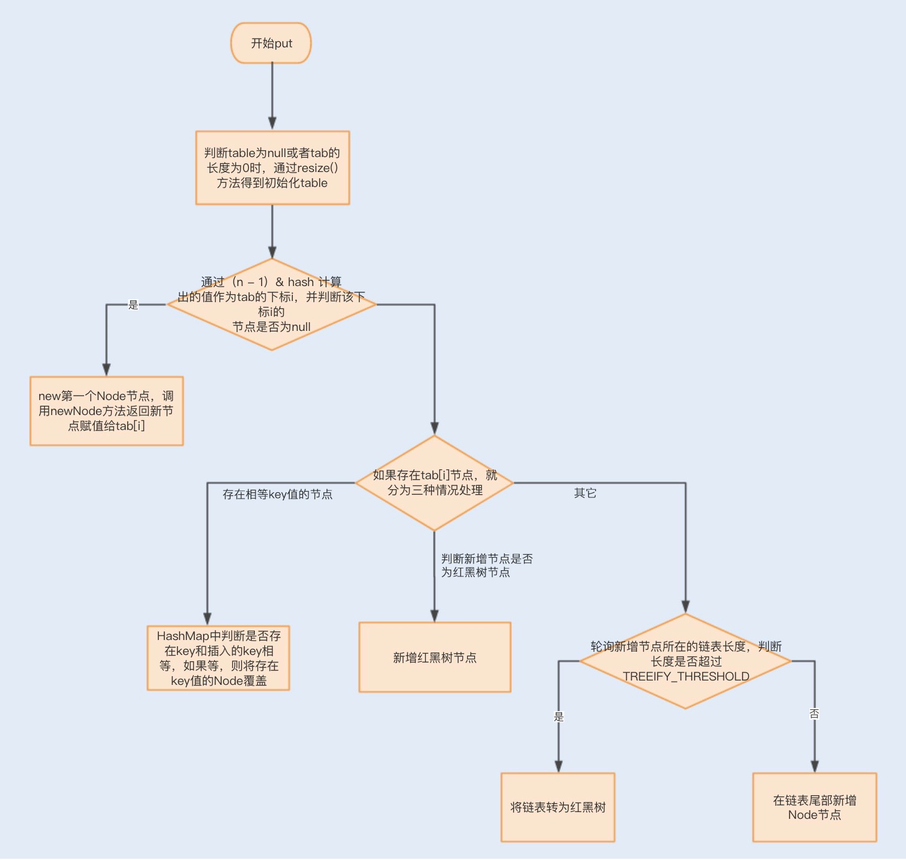
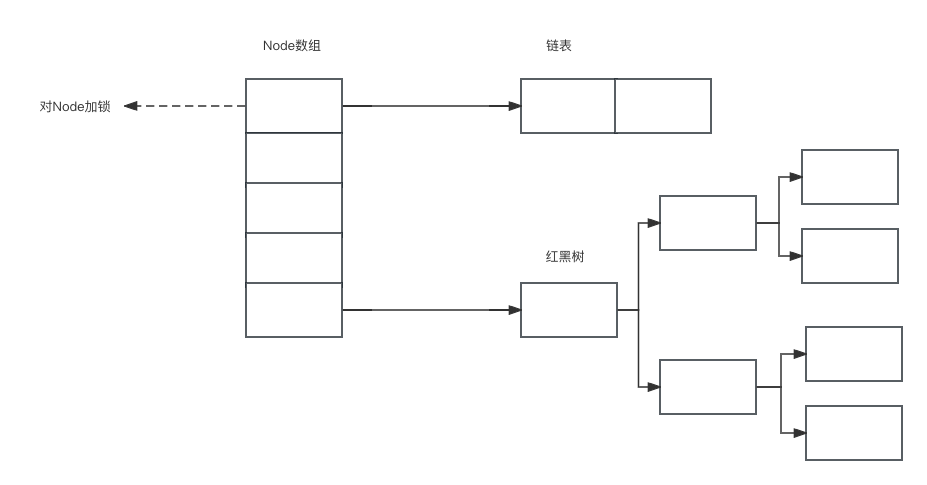

## HashMap

### HashMap数据结构

数组+链表/红黑树

HashMap 通过 key 的 hashcode 经过扰动函数处理过后得到 hash 值，然后通过 (n - 1) & hash 判断当前元素存放的位置（n是数组长度），如果当前位置存在元素的话，就判断该元素与要存入的元素的 hash 值以及 key 是否相同，

如果相同的话，直接覆盖，不相同就通过拉链法解决冲突。当链表长度大于阈值（默认为 8）（将链表转换成红黑树前会判断，如果当前数组的长度小于 64，那么会选择先进行数组扩容，而不是转换为红黑树）时，将链表转化为红黑树，以减少搜索时间。

### put()流程



put步骤：

- 判断数组。若数组为空，则进行首次扩容得到初始化的table。
- 判断头节点。若头节点为空，则新建链表节点，存入数组。若头节点非空，则将元素插入槽内。
- 插入元素后，判断元素的个数，若发现超过阈值则再次扩容。

其中，头节点非空，则将元素插入槽内，分为三种情况：

- 若元素的key与头节点一致，则直接覆盖头节点。
- 若元素为树型节点，则将元素追加到树中。
- 若元素为链表节点，则将元素追加到链表中。追加后，根据链表长度和数组容量决定是否转为红黑树。若链表长度达到8、数组容量未达到64，则扩容。若链表长度达到8、数组容量达到64，则转为红黑树。

### 扩容机制

#### 扩容时机

- 如果数组为空，则进行首次扩容得到初始化的table。
- 将元素追加到链表中，追加后根据链表长度和数组容量判断是否要转化为红黑树时，如果链表长度达到8，并且数组长度小于64，则扩容。
- 添加后，如果数组中元素超过阈值，即比例超出限制（默认为0.75），则扩容。

#### 扩容步骤

- 保存旧数组和相关信息
- 根据旧容量和旧阈值来计算新的容量和新的阈值
- 创建新数组
- 将元素从旧数组迁移到新数组
- 返回新数组

### HashMap VS Hashtable 区别

- 线程安全性：

HashMap：非线程安全

Hashtable：线程安全

- 继承关系：

HashMap：属于 Java 集合框架的一部分。

Hashtable：是一个遗留类（legacy class），在 Java 集合框架之前就存在。它实现了 Map 接口，但并没有继承自 Map 接口，而是直接继承自 Dictionary 类。

- 空键和空值：

HashMap：允许键和值都为 null。也就是说，可以插入一个键值对其中的键或值为 null。

Hashtable：不允许键或值为 null。如果尝试插入 null 值，会抛出 NullPointerException。

- 迭代器：

HashMap：提供了快速失败（fail-fast）的迭代器。在迭代过程中，如果其他线程修改了 HashMap 的结构（增加、删除元素），将会抛出 ConcurrentModificationException 异常。

Hashtable：提供了一个 enumerator（枚举器），它并不是一个迭代器，也不支持快速失败。它只能用于遍历集合，而不能进行修改。

- 性能：

由于 Hashtable 是线程安全的，它的性能可能会比 HashMap 差，因为同步操作会引入一定的开销。

### HashMap线程不安全，如何解决？

HashMap 不是线程安全的。
HashMap 的底层是利用数组+链表+红黑树的组合，在多线程的情况下，多个线程同时触发 HashMap 的时候可能会发生冲突。所以在多线程的时候不建议使用 HashMap。
如果想使用线程安全的 HashMap，可以使用 Hashtable、Collections类 将 HashMap 包装成线程安全的 HashMap、ConcurrentHashMap。推荐使用 ConcurrentHashMap。

## ConcurrentHashMap

### ConcurrentHashMap数据结构



### put()流程

```java
public V put(K key, V value) {
    return putVal(key, value, false);
}

/** Implementation for put and putIfAbsent */
final V putVal(K key, V value, boolean onlyIfAbsent) {
    // key 和 value 不能为空
    if (key == null || value == null) throw new NullPointerException();
    int hash = spread(key.hashCode());
    int binCount = 0;
    for (Node<K,V>[] tab = table;;) {
        // f = 目标位置元素
        Node<K,V> f; int n, i, fh;// fh 后面存放目标位置的元素 hash 值
        if (tab == null || (n = tab.length) == 0)
            // 数组桶为空，初始化数组桶（自旋+CAS)
            tab = initTable();
        else if ((f = tabAt(tab, i = (n - 1) & hash)) == null) {
            // 桶内为空，CAS 放入，不加锁，成功了就直接 break 跳出
            if (casTabAt(tab, i, null,new Node<K,V>(hash, key, value, null)))
                break;  // no lock when adding to empty bin
        }
        else if ((fh = f.hash) == MOVED)
            tab = helpTransfer(tab, f);
        else {
            V oldVal = null;
            // 使用 synchronized 加锁加入节点
            synchronized (f) {
                if (tabAt(tab, i) == f) {
                    // 说明是链表
                    if (fh >= 0) {
                        binCount = 1;
                        // 循环加入新的或者覆盖节点
                        for (Node<K,V> e = f;; ++binCount) {
                            K ek;
                            if (e.hash == hash &&
                                ((ek = e.key) == key ||
                                 (ek != null && key.equals(ek)))) {
                                oldVal = e.val;
                                if (!onlyIfAbsent)
                                    e.val = value;
                                break;
                            }
                            Node<K,V> pred = e;
                            if ((e = e.next) == null) {
                                pred.next = new Node<K,V>(hash, key,
                                                          value, null);
                                break;
                            }
                        }
                    }
                    else if (f instanceof TreeBin) {
                        // 红黑树
                        Node<K,V> p;
                        binCount = 2;
                        if ((p = ((TreeBin<K,V>)f).putTreeVal(hash, key,
                                                       value)) != null) {
                            oldVal = p.val;
                            if (!onlyIfAbsent)
                                p.val = value;
                        }
                    }
                }
            }
            if (binCount != 0) {
                if (binCount >= TREEIFY_THRESHOLD)
                    treeifyBin(tab, i);
                if (oldVal != null)
                    return oldVal;
                break;
            }
        }
    }
    addCount(1L, binCount);
    return null;
}
```
步骤说明：
- 根据 key 计算出 hashcode 。
- 判断是否需要进行初始化。
- 即为当前 key 定位出的 Node，如果为空表示当前位置可以写入数据，利用 CAS 尝试写入，失败则自旋保证成功。
- 如果当前位置的 hashcode == MOVED == -1,则需要进行扩容。
- 如果都不满足，则利用 synchronized 锁写入数据。
- 如果数量大于 TREEIFY_THRESHOLD 则要执行树化方法，在 treeifyBin 中会首先判断当前数组长度 ≥64 时才会将链表转换为红黑树。
