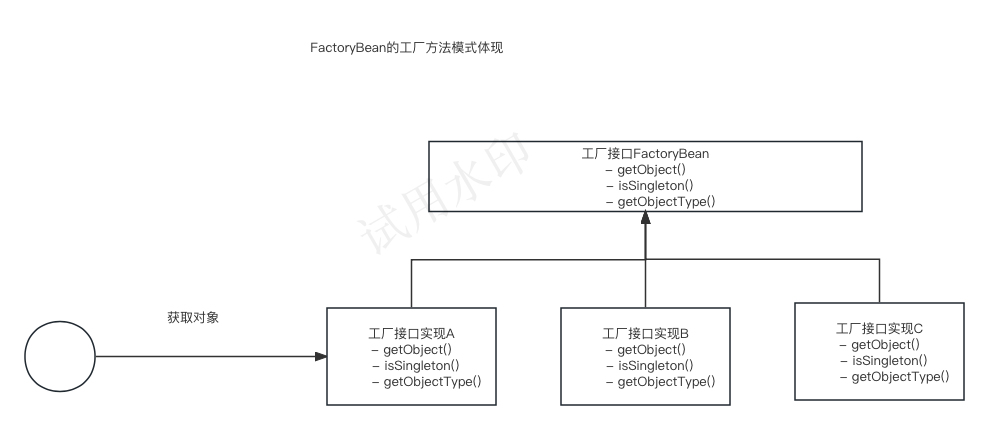
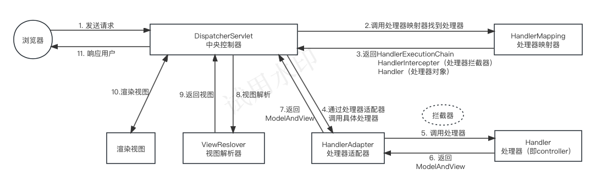
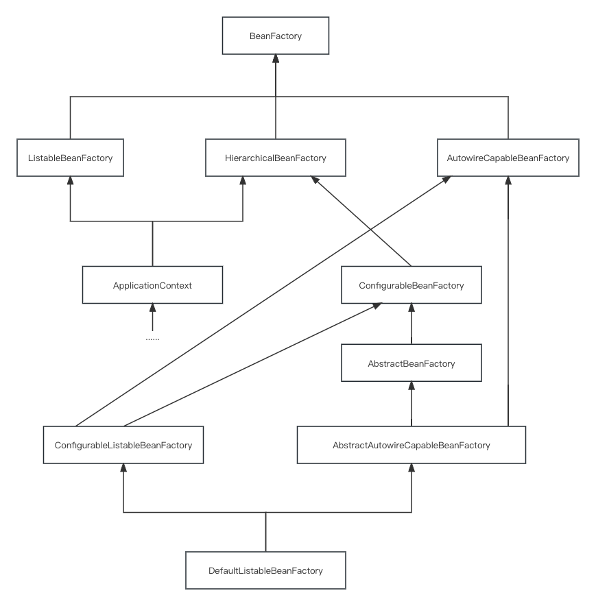

## Spring SpringBoot 相关概念

### Spring是什么

Spring 是一款开源的轻量级 Java 开发框架，旨在提高开发人员的开发效率以及系统的可维护性。Spring是很多模块的集合，比如Core Container、AOP、Data Access、Spring Web、Spring Test等。Spring通过IOC容器、AOP支持、声明式事务管理和集成框架等特性，简化了Java应用程序的开发和集成过程，提供了更高效、可维护的应用程序架构。

轻量级：Spring框架是一个轻量级的框架，不需要依赖其他重量级的框架或容器。它的核心库非常小巧，可以根据需要选择和集成其他模块。

IOC容器：Spring的核心是IOC容器，它本质是一个工厂，负责管理应用程序中的对象及其依赖关系。IoC是控制反转的意思，是一种面向对象编程的设计思想。在不采用这种思想的情况下，我们需要自己维护对象与对象之间的依赖关系，很容易造成对象之间耦合度过高。IoC可以解决这种问题，它帮我们维护对象与对象之间的依赖关系，降低对象之间的耦合度。说到IoC就不得不提到DI，DI是依赖注入的意思，它是IoC思想的实现方式，即IoC的思想可以通过DI来实现。IOC容器通过DI依赖注入的方式，将对象之间的依赖关系解耦，从而提供了更松散耦合、可维护性更强的应用程序架构。

AOP支持：Spring提供了对AOP的支持。AOP是一种面向切面编程的思想，这种思想是对OOP的补充。简单来说，它可以统一解决一批组件的共性需求（如权限检查、记录日志、事务管理等）。在AOP思想下，我们可以将解决共性需求的代码独立出来，然后通过配置的方式，声明这些代码在什么地方、什么时机调用。当满足调用条件时，AOP会将该业务代码织入到我们指定的位置，从而统一解决了问题，又不需要修改这一批组件的代码。

声明式事务管理：Spring提供了声明式事务管理的支持，使得在应用程序中使用事务变得简单而灵活。通过注解或XML配置，可以定义事务的边界和属性，Spring会自动处理事务的开始、提交或回滚。

集成框架支持：Spring提供了对多个第三方框架和技术的集成支持，如Hibernate、MyBatis、JPA、JDBC等。通过集成框架，Spring可以与这些技术无缝协作，提供更便捷的数据访问和持久化能力。

模块化设计：Spring采用了模块化的设计，将不同的功能和技术划分为多个模块。开发人员可以根据需要选择和集成所需的模块，避免了不必要的依赖和复杂性。

测试支持：Spring提供了丰富的测试支持，包括单元测试、集成测试和端到端测试。通过Spring的测试框架，可以方便地进行各种测试场景的编写和执行。

### SpringBoot是什么

SpringBoot本质上就是Spring，它是在Spring基础上构建的一个脚手架项目。它帮你完成了一些Spring Bean配置，SpringBoot使用“习惯优于配置”的理念让你的项目快速地运行起来，使用SpringBoot能很快的创建一个能独立运行、准生产级别、基于Spring框架的项目。但SpringBoot本身不提供Spring的核心功能，而是作为Spring的脚手架框架，达到快速构建项目，预设第三方配置，开箱即用的目的。SpringBoot并不是对Spring功能上的增强，而是提供了一种快速使用Spring的方式。

### SpringBoot VS Spring

- 快速创建独立 Spring 应用
   - SSM：导包、写配置、启动运行
- 直接嵌入Tomcat、Jetty or Undertow（无需部署 war 包）【Servlet容器】
   - linux  java tomcat mysql： war 放到 tomcat 的 webapps下
  - jar： java环境；  java -jar
- 重点：提供可选的starter，简化应用整合
   - 场景启动器（starter）：web、json、邮件、oss（对象存储）、异步、定时任务、缓存...
  - 导包一堆，控制好版本。
  - 为每一种场景准备了一个依赖； web-starter。mybatis-starter
- 重点：按需自动配置 Spring 以及 第三方库
   - 如果这些场景我要使用（生效）。这个场景的所有配置都会自动配置好。
  - 约定大于配置：每个场景都有很多默认配置。
  - 自定义：配置文件中修改几项就可以
- 提供生产级特性：如 监控指标、健康检查、外部化配置等
   - 监控指标、健康检查（k8s）、外部化配置
- 无代码生成、无xml

总结：springboot能简化开发，简化配置，简化整合，简化部署，简化监控，简化运维。Spring框架支持更大的灵活性和定制性。

## Spring启动流程

springboot启动流程简单概括就是先创建一个springApplication，再调用程序的run方法。

run方法流程简单概括就是程序启动前的监听器和环境准备，然后是程序启动，即围绕着ioc容器的创建、加载、刷新，最后程序调用运行。run方法核心就是程序启动时的ioc刷新过程refresh。

refresh流程简单概括就是先环境准备，beanFactory，再由beanFactory负责Bean的生命周期管理。
beanFactory的步骤主要分为获取、准备、预留处理、后置处理等步骤，值得注意的是这里有个BeanFactoryPostProcessor的工厂后置处理器，用于在IOC容器加载Bean定义之后、Bean实例化之前，对IOC容器中的Bean定义进行修改或其他扩展处理。经过一些消息和监听事件后，就是refresh流程中完成所有组件的初始化流程，即Bean的生命周期。

Bean的生命周期简单概括为四个步骤，分别为Bean的实例化、属性赋值、初始化、销毁。值得注意的是这里有个BeanPostProcessor是在Bean的初始化过程中被调用来对Bean进行定制化处理的。

## SpringBoot自动配置

### SpringBoot自动配置的核心流程

- SpringBoot应用程序启动
- 通过SpringFactories机制加载配置文件：即通过ClassLoader去获取classpath中的配置文件META-INF/spring.factories
- 筛选出所有自动配置类：在所有的配置文件META-INF/spring.factories中，筛选出以 EnableAutoConfiguration 为key的配置值
- 将这些类注入到Spring IoC容器中

### SpringBoot自动配置的原理剖析

@SpringBootApplication

- @SpringBootConfiguration -> @Configuration
- @ComponentScan
- @EnableAutoConfiguration -> @Import @Import(AutoConfigurationImportSelector.class)

### @Autowired vs @resource

@Autowired 和 @Resource 是 Java 中用于实现依赖注入两个注解，它们的作用是为了简化和提高代码的可维护性。区别如下：

- 注解来源
  
  `@Autowired`是Spring提供的注解。
  `@Resource`是JDK提供的注解。
  
- 注入方式
  
  `@Autowired`只能按类型注入，默认情况下要求依赖对象必须存在。
  如果要允许null值可以设置require属性为false。
  如果想按照名称注入，可以结合Qualifier注解一起使用。
  
  `@Resource`默认按名称注入，也可以按类型注入。它有俩属性name和type。

属性 | 行为 |
|------|------|
| 未指定 `name` | 标注字段取字段名称；标注Setter方法取属性名称|
| 同时指定 `name` 和 `type` | 指定名称和类型匹配的唯一bean | 
| 只指定 `name` 属性 | 指定名称匹配的唯一bean |
| 只指定 `type` 属性 | 指定类型匹配的唯一bean |
| 未指定 `name` 和 `type` | 默认按照 `name` 注入，找不到则按照 `type` 注入。未指定`name`时，标注字段时取字段名称,标注Setter方法时取属性名称|

### @BeanFactory vs @FactoryBean

BeanFactory：负责生产和管理Bean的一个工厂接口，提供一个Spring Ioc容器规范。
FactoryBean：Spring提供的另外一种Bean的创建方式，是通过工厂模式用来生产Bean的。

- BeanFactory具体：

BeanFactory只是个接⼝，并不是IOC容器的具体实现，但是Spring容器给出了很多种实现，如 DefaultListableBeanFactory、XmlBeanFactory、ApplicationContext等。

BeanFactory内含方法：
containsBean(String beanName)、getBean(String)、getType(String name)、getBean(String, Class)、isSingleton(String) 、getAliases(String name)

- FactoryBean为什么存在：

Spring通过反射机制利⽤ <bean><bean> 的class属性指定实现类实例化Bean，在某些情况下，实例化Bean过程⽐较复杂，如果按照传统的⽅式，则需要在 <bean> <bean> 中提供⼤量的配置信息。配置⽅式的灵活性是受限的，这时采⽤编码的⽅式可能会得到⼀个简单的⽅案。

- FactoryBean的工厂模式体现：

工厂模式是一种创建型设计模式，其主要目的是将对象的创建过程抽象出来，让子类或者工厂类决定实例化哪个类。简单工厂是一个对象负责所有具体类的实例化，而工厂方法模式是定义一个用于创建对象的接口，由一群子类负责实例化，简单工厂不具备工厂方法的弹性。在Spring中，FactoryBean采用的是典型的工厂方法模式，让FactoryBean这个工厂类决定最终实例化的类。

如图1，首先我们定义一个工厂接口如A去实现FactoryBean，再将这个FactoryBean实例A配置起来即为一个Bean。在需要获取对象时，我们先通过Spring容器获取这个FactoryBean实例A，再通过FactoryBean实例A实现的getObject()方法来生产实际的Bean。在这个过程中，FactoryBean这个Bean就充当了工厂的角色，将创建对象的细节都封装在工厂中，使得客户端代码无需关心具体的实现细节。所以说FactoryBean是个特殊的Bean，且它生产Bean的方式就是用的工厂模式。

- FactoryBean具体：
但对FactoryBean⽽⾔，这个Bean不是简单的Bean，⽽是⼀个能⽣产或者修饰对象⽣成的⼯⼚Bean,它的实现与设计模式中的⼯⼚模式和修饰器模式类似。

FactoryBean内含方法：
T getObject()：返回由FactoryBean创建的Bean实例，如果isSingleton()返回true，则该实例会放到Spring容器中单实例缓存池中；
boolean isSingleton()：返回由FactoryBean创建的Bean实例的作⽤域是singleton还是 prototype；
Class getObjectType() 返回FactoryBean创建的Bean类型。当配置⽂件中 <bean> 的class属性配置的实现类是FactoryBean时，通过getBean()⽅法返回的不是FactoryBean本身，⽽是FactoryBean#getObject()⽅法所返回的对象，相当于FactoryBean#getObject()代理了getBean()⽅法。

#### 如何实现类 AutoConfigurationImportSelector

selectImports方法中的getAutoConfigurationEntry方法步骤：

- 获取annotationMetadata的注解@EnableAutoConfiguration的属性
- 从资源文件spring.factories中获取EnableAutoConfiguration对应的所有类
- 通过在注解@EnableAutoConfiguration设置exclude的相关属性，可以排除指定的自动配置类
- 根据注解@Conditional来判断是否需要排除某些自动配置类
- 触发AutoConfiguration导入的相关事件

## 对MVC的理解

MVC是一种设计模式，MVC要实现的目标是将软件的用户界面和业务逻辑分离以使代码可扩展性、可复用性、可维护性、灵活性加强。软件按照MVC模式可分为三层，即Model（模型）、View（视图）、Controller（控制器）。将软件分层的好处是可以将对象之间的耦合度降低，便于代码的维护。

Model封装了数据和对数据的操作，是实际进行数据处理的地方，View负责进行模型的展示，一般就是我们见到的用户界面，Controller控制器负责视图和模型之间的交互，主要负责两方面的动作，一是把用户的请求分发到相应的模型，二是把模型的改变及时地响应到视图上。

## MVC设计模式与GoF 23种设计模式联系

MVC是一种模式，但却在GoF总结出来的这个23个设计模式之外，确切的说它不是一种设计模式，它是多种设计模式的组合，并不仅仅只是一个单独的一个模式。组成MVC的三个模式分别是组合模式、策咯模式、观察者模式

**View层，单独实现了组合模式**

**View层和Model层，实现了观察者模式**

**View层和Controller层，实现了策咯模式**

## Spring MVC 执行流程

## 对IoC的理解

### 什么是Ioc

IoC （Inversion of control）控制反转。它是一种思想不是一个技术实现。描述的是 Java 开发领域对象的创建以及管理的问题。

例如：现有类 A 依赖于类 B
传统的开发方式 ：在类 A 中手动 new 一个 B 的对象出来。
使用 IoC 思想的开发方式 ：通过 IoC 容器来帮助我们实例化对象。我们需要哪个对象，直接从 IoC 容器里面拿即可。

通过两种方式对比，我们 “丧失了一个权力” (创建、管理对象的权力)，从而也得到了一个好处（不用再考虑对象的创建、管理等一系列的事情）。
控制反转中的控制指的就是对象创建（实例化、管理）的权力；控制反转中的反转指的就是控制权交给外部环境（IoC 容器）。

### IoC 解决了什么问题

IoC 的思想就是两方之间不互相依赖，由第三方容器来管理相关资源。
- 对象之间的耦合度或者说依赖程度降低
- 资源变的容易管理

### IoC 和 DI 关系

IoC 是思想，DI 是实现这种思想的一种常见手段。
在 Spring 中， IoC 容器是 Spring 用来实现 IoC 的载体， IoC 容器实际上就是个 Map，Map 中存放各种对象。
IoC 容器通过 DI 依赖注入的方式，将对象之间的依赖关系解耦，从而可以让程序更松散耦合、可维护性更强。

### IoC 在 Spring 中的代码体现

ApplicationContext就是IoC容器，其内部持有一个实例化的BeanFactory（DefaultListableBeanFactory），所有的BeanFactory相关的操作都是委托给这个实例来处理的。
即IoC中的反转权是交给了BeanFactory，由BeanFactory负责对象的创建与管理。  

## 对AOP的理解

AOP(Aspect-Oriented Prograamming：面向切面编程)是一种编程思想。能够将那些与业务无关，却为业务模块所共同调用的逻辑或责任（例如事务处理、日志管理、权限控制等）封装起来，便于减少系统的重复代码，降低模块间的耦合度，并有利于未来的可扩展性和可维护性。
spring中实现AOP方式：默认策略是如果目标类是接口，则使用JDK动态代理技术，否则使用Cglib来生成代理。

**JDK动态代理：** 这种方式是在程序运行时创建一个代理对象来执行方法，是spring默认采用的方式；

**CGlib动态代理：** 这种方式采用底层字节码技术在运行时创建子类代理对象来执行方法（因为会动态创建子类，所以不能对被final修饰的目标进行代理，final修饰的类不能继承）。
AOP不能增强的类：

Spring AOP只能对IoC容器中的Bean进行增强，对于不受容器管理的对象不能增强。

由于CGLib采用动态创建子类的方式生成代理对象，所以不能对final修饰的类进行代理。

## Spring的事务管理

### 事务特性
- A 原子性（Atomicity）：事务是最小的执行单位，不允许分割。事务的原子性确保动作要么全部完成，要么完全不起作用；
- C 一致性（Consistency）：执行事务前后，数据保持一致，例如转账业务中，无论事务是否成功，转账者和收款人的总额应该是不变的；
- I 隔离性（Isolation）：并发访问数据库时，一个用户的事务不被其他事务所干扰，各并发事务之间数据库是独立的；
- D 持久性（Durability）：一个事务被提交之后。它对数据库中数据的改变是持久的，即使数据库发生故障也不应该对其有任何影响。

只有保证了事务的持久性、原子性、隔离性之后，一致性才能得到保障。也就是说 A、I、D 是手段，C 是目的！

### Spring 支持两种方式的事务管理

- 编程式事务管理

编程式事务管理是通过编写代码来控制事务的开始、提交和回滚。例如使用TransactionTemplate。这种方式更灵活，事务管理的范围控制的更精确。

- 声明式事务管理

声明式事务管理是通过配置的方式来管理事务，而不需要在代码中显式地控制事务。例如使用 @Transactional注解。这种方式很方便。当标注在类上时，代表这个类所有公共（public）非静态的方法都将启用事务功能。当标注在方法上时，代表这个方法将启用事务功能。
